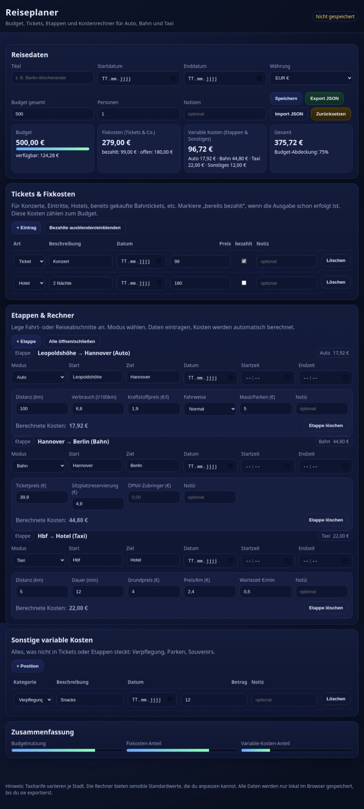

# 🧳 Reiseplaner

> **Moderner, lokaler Reise- und Budgetplaner** – Plane Etappen, tracke Kosten, behalte dein Budget im Blick. Komplett offline, keine Cloud, deine Daten bleiben bei dir.

[](https://timintech.github.io/reiseplaner/)
[](LICENSE)
[](https://timintech.github.io/reiseplaner/)

<p align="center">
  <a href="https://timintech.github.io/reiseplaner/">
    
  </a>
</p>

---

## ✨ Features

| Feature | Beschreibung |
|---------|-------------|
| 📊 **Budget-Dashboard** | Echtzeit-Übersicht über Budget, Fixkosten und variable Kosten |
| 🎫 **Tickets & Fixkosten** | Hotels, Konzerte, Eintritte mit "bezahlt"-Status tracken |
| 🗺️ **Etappen-Planer** | 7 Transportmodi mit automatischer Kostenberechnung |
| 💾 **Lokale Speicherung** | Alle Daten im Browser – keine Cloud, kein Account |
| 📤 **Export/Import** | JSON-Backup deiner Reisedaten |
| 📱 **Mobile-First** | Optimiert für Smartphones und Tablets |
| 🌙 **Dark Mode** | Augenschonendes dunkles Design |

---

## 🚗 Unterstützte Transportmodi

| Modus | Kostenberechnung |
|-------|-----------------|
| 🚗 **Auto** | Distanz × Verbrauch × Kraftstoffpreis + Maut/Parken |
| 🚆 **Bahn** | Ticket + Reservierung + ÖPNV-Zubringer |
| 🚕 **Taxi** | Grundpreis + (km × €/km) + (Minuten × Wartezeit) |
| ✈️ **Flug** | Flugpreis + Gepäck/Extras |
| 🚌 **ÖPNV** | Ticketpreis |
| 🚲 **Fahrrad** | Leihgebühr (optional) |
| 🚶 **Zu Fuß** | Kostenlos |

---

## 🚀 Schnellstart

### Option 1: Online nutzen (empfohlen)

👉 **[timintech.github.io/reiseplaner](https://timintech.github.io/reiseplaner/)**

### Option 2: Lokal ausführen

```bash
# Repository klonen
git clone https://github.com/TimInTech/reiseplaner.git
cd reiseplaner

# Im Browser öffnen
# Windows: start index.html
# macOS:   open index.html
# Linux:   xdg-open index.html
```

> 💡 **Keine Installation nötig!** Eine einzelne HTML-Datei ohne Abhängigkeiten.

---

## 🛠️ Technologie


- **Single-File App** – Alles in einer HTML-Datei
- **Vanilla JS** – Keine Frameworks, keine Build-Tools
- **LocalStorage** – Persistente Speicherung im Browser
- **Offline-fähig** – Funktioniert ohne Internet

---

## 💾 Datenspeicherung

Alle Daten werden **ausschließlich lokal** gespeichert:

- 🔒 Keine Cloud, keine Server
- 🚫 Kein Tracking, keine Analytics
- 📤 JSON Export für Backups
- 📥 JSON Import auf anderen Geräten

---

## 📋 Changelog

Siehe [CHANGELOG.md](CHANGELOG.md) für alle Änderungen.

**v2.0.0** (Dezember 2024)
- Mobile-First Redesign
- Touch-optimierte Bedienung
- 7 Transportmodi
- Verbessertes KPI-Dashboard

---

## 🤝 Beitragen

Beiträge willkommen! Siehe [CONTRIBUTING.md](CONTRIBUTING.md).

```bash
git checkout -b feature/mein-feature
git commit -m "feat: Beschreibung"
git push origin feature/mein-feature
```

---

## 📄 Lizenz

MIT License © 2025 [TimInTech](https://github.com/TimInTech)

---

<p align="center">
  <strong>⭐ Gefällt dir das Projekt? Gib einen Stern!</strong>
</p>
