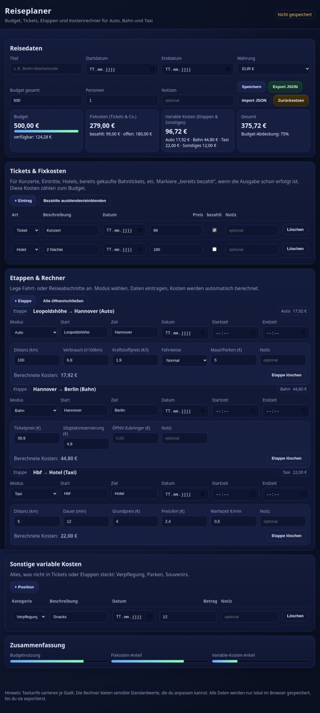

# 🧳 Reiseplaner

Der Reiseplaner ist ein schlankes, interaktives Tool zur schnellen Reise-Kalkulation mit klarer Kostenübersicht und einfacher Grafik. Links trägst du Reisedauer und Kosten ein, rechts siehst du sofort Gesamtkosten, Kosten pro Tag, Gesamtzeitaufwand und eine Balkengrafik der Verteilung.

[👉 Live-Demo öffnen](https://timintech.github.io/reiseplaner/)

[](https://timintech.github.io/reiseplaner/ "Zur Live-Demo")

---

## Funktionen in Kürze

Eingaben: Reisedauer (Tage), Unterkunft gesamt oder pro Tag, Verpflegung pro Tag, Bahnkosten (Hin-/Rückfahrt), sonstige Einmalkosten, An- und Rückreisezeit in Stunden.  
Ausgaben: Gesamtkosten, Kosten pro Tag, Gesamtzeitaufwand in Stunden, tabellarische Übersicht und Balkendiagramm.

---

## Hauptschritt

1) Trage die Reisedauer in Tagen ein.  
2) Entscheide, ob du Unterkunft als Gesamtsumme oder pro Tag angibst.  
3) Setze bei Bedarf Verpflegung pro Tag, Bahnkosten (Hin- und Rückfahrt) und sonstige Einmalkosten.  
4) Ergänze Anreise- und Rückreisezeit (Stunden), wenn du den Gesamtzeitaufwand sehen willst.  
5) Die Auswertung passiert automatisch.

➡️ [Zum Anfang](#-reiseplaner)

---

## Nutzung lokal

1) Repository klonen.
```bash
cd ~
git clone https://github.com/TimInTech/reiseplaner.git
cd reiseplaner
